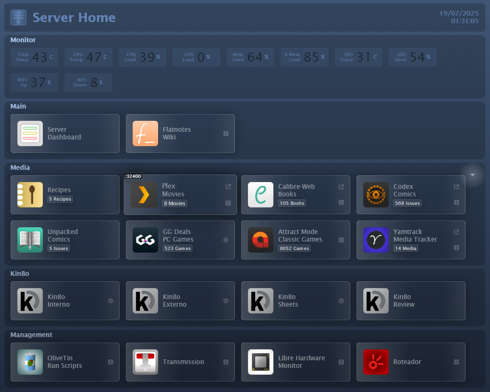
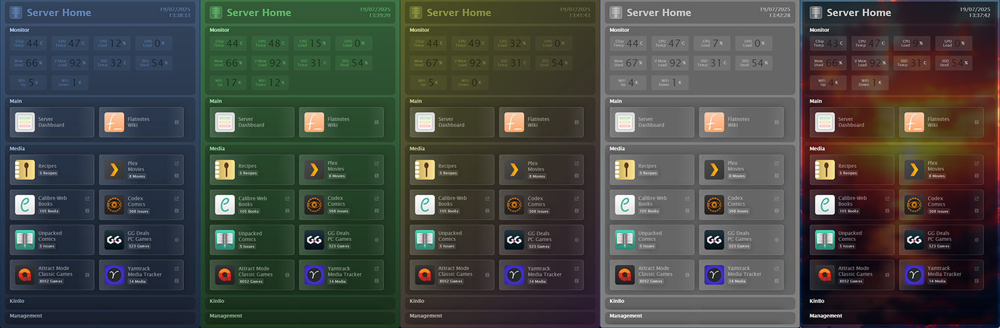
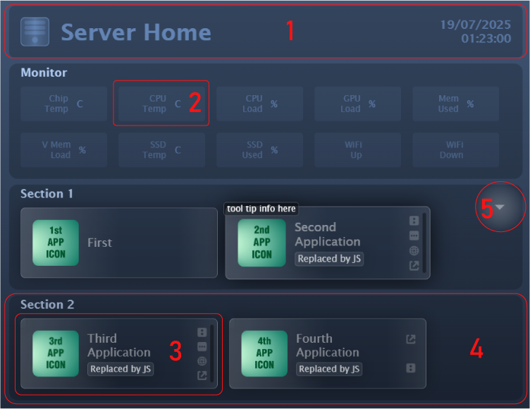
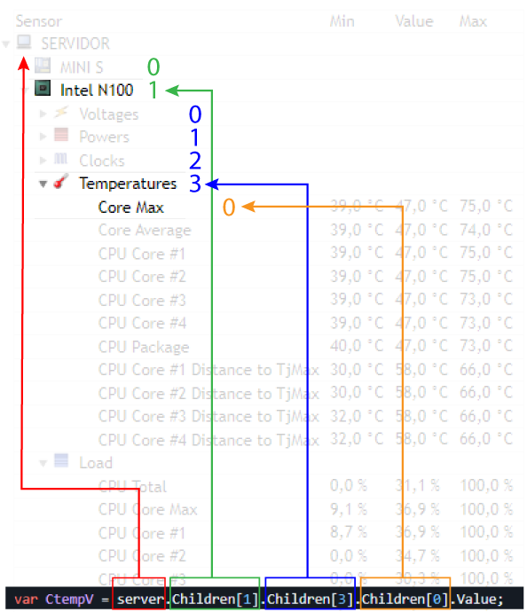

# Server Home  
(As if we needed another server dashboard called Home)  
  
Server Home is a very simple server dashboard that came to existence very slowly, organically, following the needs of my very simple server as it grew.  
A had to gradually learn HTML, CSS and JS to implement it and everything is still going on, still very much a work in progress.  
I looked at other dashboards but found them a bit too much for my simple setup. Also, the one I had was so attuned to my needs I could't justify replacing it.  
I never thought about publishing but some people on Reddit seems to love the thing (you know who you are, freaks!) so I promised to drop it here.  
And here we are.  

  
> All the features are explained below.  
  
## What it is  
Server Home (it's not even a name, it's a description) is just an HTML, with some JS, a CSS and a folder with images. That is it.  
  
## How to install   
Just throw the the contents of `Home` (`index.html`, `styles.css` and the folder `images`) inside an HTTP server and there you go.  
Of course you still have to customize it and that is what we will do from now on.  
  
> If you are reading this you probably know how to create an HTTP server. If you don't, the internet can explain it way better than me.  
  
## The CSS
First lets talk about the CSS because I will not discuss it again.  
The CSS is where you define the appearance of the page. Colors and forms, sizes and shapes. Open the commented file, I try to explain things there. Mess around, customize it to your liking, it is really easy to change basic things that give a whole new feel to the page.  
For instance, one of the advantages of the "glass" interface is that you can change the whole feel just by changing the `background` style:  
It is also easy to use an image background and even apply effects to it.  
Uncomment the lines to see the result.  
  
  
  
```css
body {
  font-family:'Lucida Sans', 'Lucida Sans Regular', 'Lucida Grande', 'Lucida Sans Unicode', Geneva, Verdana, sans-serif;
  background: linear-gradient(180deg,
                            #405675 0%,
                            #1f293a 100%);
  /* background: gray; */
  background-attachment: fixed;
  background-position: center;
  background-size: cover;
  /* background-image: url("images/background.jpg"); */
  /* backdrop-filter: blur(10px) brightness(50%); */
  text-align: center;
}
```
Other thing to notice is the `@media` section at the bottom of the file, it is what gives the responsiveness to the page. Repeat the classes here changing the parameters you want to take effect on a mobile device.  
```css
@media only screen and (max-device-width: 1080px){
```
    
## Customizing the HTML  
  
  
  
> Have I told you I had virtually no knowledge of HTML, JS and CSS when building the thing? Well, keep it in mind going forward.  
  
> I thought about implementing an YAML file or even a GUI section to configure the dashboard, but frankly, editing the HTML is just marginally more complicated than an YAML file and a GUI configuration would over complicate things.   
  
This will be a very basic explanation. If you know this stuff, maybe just look at the commented file or even the clean one.  
Inside the `Home` folder you will find all the files for the dashboard. Inside `Home-commented` there are heavily commented versions of the same files. All the images/icons are inside the `images` folder in `Home`. There are SVG versions of them in `icons-svg`.  
You only need to edit `index.html`, it already has everything, just move and modify the things there to configure the page.    
Lets go.  
  
---
The file begins with a `head` section where we define the title and the icon to appear on the browser window along with the associated CSS.  
You can have different CSS files and just replace or reference them to quickly change the page style.  
```html
<!DOCTYPE html>
<html lang="en">
<head>
  <meta charset="UTF-8">
  <title>Server Home</title>
  <link rel="stylesheet" href="styles.css">
  <link rel="icon" type="image/png" href="images/server-icon.png">
</head>
<body>
```
---
Then we move to the content itself, beginning with the header (1) where we have the tile, the logo and the time.  
  
The logo is an image file, the title is right there on the code and the clock is on the div with the id `time`. This id is what the JavaScript uses to find the div and update its content.  
```html
  <div class="header-row">
    <div class="title">
      
      <span>Server Home</span>
    </div>
    <div class="time-display" id="time"></div>
  </div>
```
---
Lets skip the monitor section for now.  

---
After the monitor we have the panels (4) that holds the app/service buttons (3). Hovering over the panels reveals a button on the right (5) to collapse or expand them.  

```html
  <div class="panels">
    <button type="button" class="collapsible"></button>
    <div class="content">
        <div class="category-text-base">Section 1</div>
        <div class="category-text">Section 1</div>

        <!-- first button -->
        <a class="project-link" href="http://ip:port">
          
          <div class="text">
            <span>First</span>
          </div>
        </a>

        <!-- second button -->
        <a class="project-link" href="http://ip:port">
          <div class="detail">tool tip info here</div>
          <div class="feature-icons">
            
            
            
            
          </div>
          <div id="second-timeout" class="timeout"></div>
          
          <div class="text">
            <span>Second<br>Application</span>
            <span class="widget" id="n-second">widget info here</span>
          </div>
        </a>

      </div>
    </div>
```
To create more panels, make a copy of one of them, change the name and add/delete/modify the code for the buttons inside them.  
  
To change the name of the panel, change the title on the classes `category-text-base` and `category-text`. There are two of them because they are overlapped to produce a better visual effect.  
  
The buttons are the blocks with the class `project-link`. This panel has two buttons, the first one has almost no features and the second has all the features available. To make new buttons just copy one of them and add or remove the features you want.   
  
Lets examine the second button:  
The first line contains the button class and the link (`href`) that point to what you want to access. Enter the IP and port (or folder or whatever) of the service/app you want to call.  
  
The second line, with the class `detail`, is a tool tip that appears on the top left when you hover the button. I use it to display and remind me of the port, IP or folder where the service is located.  
  
The lines 3 to 8, the `feature-icons` div, is a block of icons on the right that shows some labels regarding the button. They remind of the characteristics of the button and the app in question. There are four of them with icons created, they mean:  
. The app is on another port (a box with 2 vertical points).  
. The app is on a different IP (a box with 3 horizontal points).  
. The app is an external site, on the internet (a globe).  
. The app will open on a different window (a box with an outward arrow).  
Leave or delete whatever you want to appear on the button.  
You can, of course, make new ones. `src` points to the icon image and `alt` is what appears if the image is not found.  
  
Next we have the timeout div. This is a vertical line that appears at the far right of the button to indicate if the app/service is offline. A white line means it did not initially responded and a black line indicates that it did not respond at the end of the alloted time try (5 seconds).  
This div is controlled by the JavaScript through the id parameter (`second-timeout` in this case). Give each button an unique timeout id so that JavaScript can find and modify them.  

Then we have the icon for the button. The `src` is the path to the image and `alt` is what will appear if the image is missing.  

And finally we have the `text` class that holds the button text itself and the button `widget`. If you want more than one line on the button text, use the `<br>` tag that works as a linefeed.  The widget is text box below the main text that can hold additional information.  
The `widget` class is updated by the JavaScript (through the id tag) so the text here will be replaced (you can comment the corresponding JS line and the text here will stay). If using this feature with JS, remember to give an unique id for each one and reference it on JS.  
I use the `widget` class to show the amount of items on my media apps: movies, books, tec. I have a Python script that looks for my media and directly modify the JS, substituting the corresponding lines with the updated values.  
  
> I probably should't do this. I probably should have a JSON that would be created by Python and accessed by JS. But I'm writing this, so tomorrow, maybe.  

> Unfortunately, the Python script is very specific to my setup it is not included in this repo.  
---
That is it for the HTML, it ends with:
```html
</body>
</html>
```


 Now lets take a look at  

## The JavaScript  

The JS is placed between the tags:  
```html
<script>
</script>
```

First we have the lines that modify the `widget` class:  
```js
document.getElementById("n-second").textContent = "Replaced by JS"
document.getElementById("n-third").textContent = "Replaced by JS"
document.getElementById("n-fourth").textContent = "Replaced by JS"
```
Note the `n-second`, `n-third` and `n-fourth` strings. They are the id of the widget to be modified. The string at the end is the content to apply to the widget.  
As said earlier, the text here will substitute the HTML text. Comment or delete the lines here to set the text in the HTML.  

---
Next is the function responsible for the collapse and expansion of the panels.  
It is called whenever the collapse/expand button is clicked.  
```js
var coll = document.getElementsByClassName("collapsible");
var i;
for (i = 0; i < coll.length; i++) {
  coll[i].addEventListener("click", function() {
    this.classList.toggle("active");
    var content = this.nextElementSibling;
    if (content.style.maxHeight == "0px"){
      content.style.maxHeight = "fit-content";
      content.style.paddingTop = "40px";
      content.style.paddingBottom = "20px";
    } else {
      content.style.maxHeight = "0px";
      content.style.paddingTop = "50px";
      content.style.paddingBottom = "0px";
    }
  });
}
```
You don't need to change anything here unless you want to change the behavior of the panels collapse/expansion.  
The first set of parameters on the `if` statement are the default, expanded, state and the second are the collapsed state parameters. The expanded parameters are duplicated on the `.content` class in the CSS file.  
`content.style.maxHeight` is what controls the state of the collapse. If it is `0px` the panel is collapsed, if not (`fit-content` in this case) it is expanded. That is what the `if` uses to toggle the state.  

---
The next function updates the date and time  
It is called every second.  
```js
function updateTime() {
  const now = new Date();
  const formattedDate = now.toLocaleDateString("pt-br", { timeZone: 'America/Recife', hour12: false });
  const formattedTime = now.toLocaleTimeString("pt-br", { hour12: false });
  document.getElementById("time").textContent = `${formattedDate}\n${formattedTime}`;
}  
```
Change `pt-br` and `America/Recife` to whatever configuration represents where you are.  

---

Again, lets skip the monitoring.  

---
This is the function that checks whether the apps are online. This is a very rudimentary and simple approach but it is working so far. I will update it in the future but for now it is the only solution that works equally for all the services and apps I have.  
```js
async function checkServiceStatus(service, url) {
  document.getElementById(service).style.backgroundColor = "#ffffff33"
  try {
    const response = await fetch(url, {mode: 'no-cors', signal: AbortSignal.timeout(5000)});
    if (response) {
      document.getElementById(service).style.backgroundColor = "#00000000"
      return true;
    } else {
      return false;
    }
  } catch (e) {
      if (e.name === "TimeoutError") {
          document.getElementById(service).style.backgroundColor = "#00000088"
        }
      }
    }
```
First, the function turn on the offline indicator on temporary mode (a transparent white `#ffffff33`), indicating it did not contacted the app but will try. The function then tries to access the app. For security reasons, the response is opaque (without meaningful information) but if there is any response at all the app is probably online. Maybe not running or healthy but online. The `5000` is the amount of time (5 seconds) it will wait before declaring the app offline.  
If there is a response, the function turns off the offline indicator on the corresponding button (making it fully transparent `#00000000`).  
If a `TimeoutError` occur, the indicator will change to the final state (a transparent black `#00000088`), indicating the service could not be contacted on the allocated time.  
The `service` variable contains the id of the HTML div of the offline indicator on the corresponding button as stated above on the HTML section. It is passed by the function call along with the ip and port of the app.  

To call this function on all the buttons at once, the calls are placed inside a wrapper function (`check_health()`) that is called every 60 seconds.  
Each button that has an offline indicator must have a call here. The first parameter is the offline indicator div id for the button and the second parameter is the ip (and port) of the app/service to be checked (beware that sometimes only the ip and port are not enough, Plex, for instance seems to need a `/identity` at the end of the url for this to work).  
```js
function check_health() {
  checkServiceStatus('second-timeout', 'http://ip:port');
  checkServiceStatus('third-timeout', 'http://ip:port');
  checkServiceStatus('fourth-timeout', 'http://ip:port');
}
```
---
At last we have a wrapper that calls the time and monitor functions every second...  
```js
function runOnInterval() {
  updateTime();
  getData();
}
```
...the setup for the calling intervals: the wrapper for the time and monitor every second (`1000`ms) and the wrapper for the offline check every 60 seconds (`60000`ms)  
```js
setInterval(runOnInterval, 1000);
setInterval(check_health, 60000)
```
...and we run them once right at the opening of the page.  
```js
check_health()
runOnInterval();
```

## The Monitoring
Finally.  

The monitoring is done by Libre Hardware Monitor. We read from its web interface that provides a JSON file updated every second on `http://ip:port/data.json`.  

> With a little knowledge of JavaScript it is possible to adapt the routine to use any other app that provides monitoring data.  
  
The monitoring widgets (2) are placed inside a panel just like the buttons. Here is a reduced example of the monitoring section on the HTML:  
```html
  <div class="panels">
    <button type="button" class="collapsible"></button>
    <div class="content">
      <div class="category-text-base">Monitor</div>
      <div class="category-text">Monitor</div>

      <div class="monitor">
        <div class="m-text">CPU<br>Temp</div>
        <div id="cput" class="m-value"></div>
        <div class="m-unity">C</div>
      </div>

      <div class="monitor">
        <div class="m-text">CPU<br>Load</div>
        <div id="cpul" class="m-value"></div>
        <div class="m-unity">%</div>
      </div>

      <div class="monitor">
        <div class="m-text">WiFi<br>Up</div>
        <div id="wifiu" class="m-value"></div>
        <div id="wifiu-u" class="m-unity"></div>
      </div>

    </div>
  </div>

```
The widgets inside the monitoring panel have the following characteristics:  
  
. Each class `monitor` holds one widget.  
. the class `m-text` is the label of the widget.  
. The class `m-value` is the actual value of the sensor monitored. It has an unique id that is referenced by the JavaScript that updates the text.  
. The class `m-unity` is the unity of the value data. They are hardcoded in the HTML with the exception of the WiFi ones that are not fixed (the show `kb/s`, `mb/s`, etc) and are updated by the JS as well.  
  
Duplicate a `monitor` block and change its text and id to create a new monitoring widget.  

Now lets take a look at the JavaScript. Also reduced to match the HTML:  
```js
const url = "http://ip:port/data.json";
async function getData() {
  try {
    const response = await fetch(url);
    if (!response.ok) {
      throw new Error(`Response status: ${response.status}`);
    }
    const json = await response.json();
    const server = json.Children[0]

    var CtempV = server.Children[1].Children[3].Children[0].Value;
    document.getElementById("cput").textContent = `${CtempV.slice(0, -5)}`;

    var CloadV = server.Children[1].Children[4].Children[0].Value;
    document.getElementById("cpul").textContent = `${CloadV.slice(0, -4)}`;
    
    var WuplV = server.Children[11].Children[2].Children[0].Value;
    document.getElementById("wifiu").textContent = `${WuplV.slice(0, -7)}`;
    document.getElementById("wifiu-u").textContent = `${WuplV[WuplV.length - 4]}`;

} catch (error) {
    console.error(error.message);
  }
}

```
We begin by creating a variable to hold the url with the path to the `data.json` file on the web interface of LHM.  
Then we get the file and make a JSON object out of it (`const json = await response.json();`)  
And finally we parse the JSON.  
First we create a constant to hold the root of the JSON (`const server = json.Children[0]`), saving one step further on.  
Then we create a variable pointing to the sensor value we want (`var CtempV = server.Children[1].Children[3].Children[0].Value;`) and change the text on the HTML div with the corresponding id.  
In this example, we get the HTML div with the id `cput` and change its text to the contents of the variable `CtempV` (`document.getElementById("cput").textContent = '${CtempV.slice(0, -5)}';`).  
Note the `slice(0, -5)` function after the variable. LHM provides the values with decimal places and unities (i.e. `40,0 °C`) and we want only the integer part. So we crop five characters (`-5`) from the end of the string.  If the value was a percentile (i.e. `56,0 %`), we would crop only four. The same goes for other values.  
In the case of the WiFi unity, we have to get only the fourth character from the end of the string (i.e. `234 kb/s`, `k` in this example) so we use `[WuplV.length - 4]` after the variable to count the length of the string (`.length`) and trace back 4 characters (`-4`) to get it.  
  
But how do we find the sensor we want?  
Each computer will give a slight different JSON structure so we need to count Children to find the sensor data.  
Looking at the interface of LWH, in both the app interface as well as the web interface:   
. The first Children is the computer itself, the `server = json.Children[0]`.  
. The next Children are the systems within the computer: chipset, CPU, GPU, WiFi, etc.  
. The next Children are the types of sensors inside the system: voltages, temperature, load, etc.   
. And finally the sensor Children itself: core max, core average, CPU core #1, etc.  
. You also have to tell what you want ro read from the sensor: text, min, value, max, etc.  
So in the example `var CtempV = server.Children[1].Children[3].Children[0].Value;`, from right to left, gets the `value` of the Core Max (`Children[0]`) of the Temperatures (`Children[3]`) of the CPU (`Children[1]`) of the server.  
  
> Note that the Children index begin with 0, so the fourth Children is actually `Children[3]`.  
  
  
  
## And that is it   
  
I think.  
  
---  
There is no server dashboard like Home (is this why there are so many Home ones?)  
  
---
## Acknowledgments  
I don't think this will harm your computer but just in case remember this is provided as is, I can't guarantee anything.  
And, as a friend of mine used to say: if you find any bugs, that is your problem!  
(just kidding)  

Cheers!  