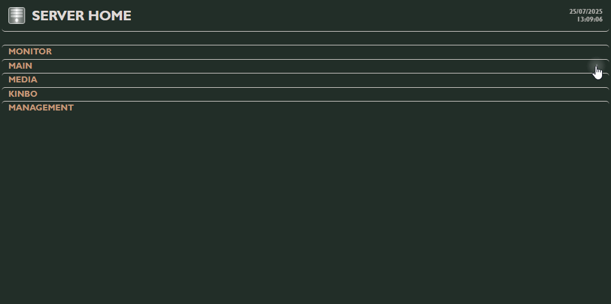

# Server Home  
(As if we needed another server dashboard called Home)  
  
Server Home is a very simple server dashboard that came to existence very slowly, organically, following the needs of my very simple server as it grew.  
A had to gradually learn HTML, CSS and JS to implement it and everything is still going on, still very much a work in progress.  
I looked at other dashboards but found them a bit too much for my simple setup. Also, the one I had was so attuned to my needs I could't justify replacing it.  
I never thought about publishing but some people on Reddit seems to love the thing (you know who you are, freaks!) so I promised to drop it here.  
And here we are.  
  
  
  
## What it is  
Server Home (it's not even a name, it's a description) is just an HTML, with some JS, a CSS and a folder with images. That is it.  
I just needed a glorified bookmark for my services, one easily accessible and usable. Also nice is that I can have actual information about my server. Monitoring of the hardware, if a service is online, what is the behavior of each button, etc.  
I also have a very simple integration with a python script that scours my media folders and reports to a JSON that updates the dashboard.  
  
## What is new  
- HTML  
  - Added a class to the project icon image to give more design options.  
  - Added an id to the collapse content div to help control its status.  
  
- CSS   
  - Made all size and position parameters in CSS scalable and reduced it to 0.75 (`--global-scale` variable).  
  - Moved all design properties here (some of them were defined in JS).  
  - Removed hover animation from the collapse button.  
  - Widened the monitor widgets to better fit the button dimensions.  
  - Added two example CSS themes with very different styles for inspiration.  
  
- JS  
  - Removed the widget section.  
  - Moved all design properties to CSS (some of them were defined here).  
  - The state of the panels collapse is now saved and restored when opening the dashboard.  
  - The monitoring stops when the panel is collapsed.  
  
## How to install   
Just throw the the contents of `Home` inside an HTTP server and there you go.  
  
> If you are reading this you probably know how to create an HTTP server. If you don't, the internet can explain it way better than me.  
  
## Configuration  
Because it is very simple and barebones, the configuration is all done within the HTML, CSS and JS themselves but I kept it all simple, modular and I thoroughly explain everything.  
  
[How to configure the thing](configuration.md)  
  
One of the advantages of the default "glass" interface is that you can very easily change the whole feel just by changing one or two lines on the CSS file. The same is true for a background image and to apply effects to it.  
  
  
  
It is also very easy to change the whole theme by just replacing (or referencing) the CSS file.  
There are two more themes included, they are just examples of what can be achieved by experimenting with the CSS.  
  
Default|Flat|Emboss
:-----:|:--:|:----:
||  
  
## Acknowledgments  
There is no server dashboard like Home (is this why there are so many Home ones?)  
  
---
I don't think this will harm your computer but just in case remember this is provided as is, I can't guarantee anything.  
And, as a friend of mine used to say: if you find any bugs, that is your problem!  
(just kidding)  
  
Cheers!  